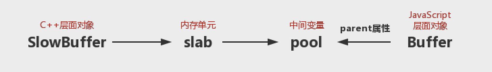

### Buffer

* * *

> Buffer对象的出现，是为了解决Node中应用需要处理大量二进制数据的场景，比如网络协议、操作数据库、处理图片、接收上传文件等。

[TOC]
* * *

#### Buffer结构

`Buffer`是一个类似于Array的对象，但它主要用于操作字节。

`Buffer`对象的元素为**16**进制的两位数，即**0～255**的数值。`Buffer`对象类似数组对象一样，可以通过**length**访问长度，可以根据下标取值或赋值。
`var buf = new Buffer(100)`
上述代码块创建了一个长度为100的`buffer`对象，此时`console.log(buf[20])`将会打印出一个**0～255**之间的随机数。
> 注：如果给一个`buffer`对象中的元素赋值个非**0~255**之间的数或者赋值小数会得到什么结果呢？如果给元素的赋值小于0，则会逐次加255直到该值在**0～255**之间，反之如果大于255，逐次减255；如果赋值是个小数，会去掉小数位只保留整数位。

* * *

#### Buffer对象的内存分配

> C++层面申请内存，JavaScript层面分配内存。

**`slab`分配机制**
`slab`是一块已经申请好的固定大小的内存区域,它具有三种状态，`full-完全分配状态`、`partial-部分分配状态`、`empty-没有被分配状态`。每个`slab`大小有**8KB**，Node以**8KB**来区分`Buffer`对象是**大对象**还是**小对象**。

- **分配小对象（<8KB）**
`SlowBuffer`对象是在 **C++** 层面上，创建一个新的`slab`单元时，处于分配状态的slab单元指向一个中间变量`pool`。在通过`new Buffer()`创建`Buffer`对象时，会检查`pool`对象是否存在，如果不存在则建立一个新的`slab`对象指向它，同时当前`Buffer`对象的**parent**属性指向该`slab`，并更新`slab`状态。

 

再次创建`Buffer`对象时，会先判断这个`slab`单元是否有足够空间，如果不够久创建并使用新的`slab`单元，上一个`slab`单元的剩余空间会浪费掉。
> **注：一个`slab`单元只有当其中所有的`Buffer`对象的作用域释放并都可以回收时，该单元的8KB空间才可以被回收**。

- **分配大对象（>8KB）**
分配大对象时，会直接将`SlowBuffer`对象作为一个`slab`单元，这个`slab`单元会被`Buffer`对象独占。

* * *

#### Buffer的转换

- **字符串转Buffer**
```
// 构造函数方式
var buf = new Buffer(str,[encoding])
// 直接写入
buf.write(string,[offset],[length],[encoding])
```
一个`Buffer`对象可以通过`write()`方法写入不同编码类型的字符串转码的值，但是通过构造函数转换的`Buffer`对象存储的只能是一种编码类型，`encoding`若不传则默认值为`UTF-8`。
- **Buffer转字符串**

```
buf.toString([encoding],[start],[end])
```
`toString()`方法可以通过指定`start`和`end`实现buffer对象的局部转换。

- **Buffer支持的编码类型**
```
Buffer.isEncoding(encoding)//true or false
```
通过`isEncoding`函数可以判断某编码类型是否可以转换。但是Node的Buffer对象支持的编码类型有限，在中国常用的**GBK**、**GB2312**和**BIG-5**编码都不在支持的列表中。
对于不支持的编码类型，可以借助Node生态圈中的模块，`iconv`和`iconv-lite`可以支持更多的编码类型的转换。

* * *

#### Buffer拼接

**乱码是如何产生的**
```
// 流读取
var fs = require('fs');
var rs = fs.createReadStream('test.md');
var data = ''
rs.on('data',function(chunk){
    data += chunk // chunk是buffer对象
    // 'data+=chunk'实际上是 'data=data.toString() + chunk.toString()'
})
res.on('end', function(){
    console.log(data)
})
```
`buf.toString()`方法默认为**UTF-8**编码，中文字在**UTF-8**编码下占**3**个字节，如果限制文件可读流的长度使得在读取中文字符时发生截断，**3个字节在两段`buffer`中**，那么采取`toString`方法就会导致中文字符无法显示，文字丢失。

**正确拼接Buffer的方法**
正确的拼接方法即是将多个小`Buffer`对象拼接为一个`Buffer`对象，然后通过`iconv-lite`等模块来转码。
```
var chunks = []
var size = 0
res.on('data',function(chunk){
    chunks.push(chunk);
    size+=chunk.length
})
res.on('end',function(){
    var buf = Buffer.concat(chunks,size)
    var str = iconv.decode(buf,'utf-8')
})
```

* * *

#### Buffer与性能

> 提高字符串到Buffer的转换效率，可以很大程度地提高网络吞吐率。

**网络传输性能**
网络传输一般会转换为`Buffer`，以二进制进行传输。
通过预先转换静态内容为`Buffer`对象，可以有效减少CPU的重复使用，节省服务器资源。

> 在**Node**构建的应用中，可以选择将页面中的静态内容和动态内容分离，静态内容部分可通过预先转换为`Buffer`的方式提升性能。
> 由于文件自身是二进制数据，所以在不需要改变内容的场景下，尽量只读取`Buffer`,然后直接传输，不做额外的转换，避免损耗。

**文件传输**
`fs.createReadStream(path,opts)`中，`opts`可以传入如下参数:
```
{
    flag:'r',
    encoding:null,
    fd:null,
    mode:0666,
    highWaterMark:64*1024
}
```
其中`highWaterMark`指的是读取流的最大长度。
因为`fs.createReadStream`的工作方式是先在内存中准备一段`Buffer`，完成一次读取就通过`slice`方法截取部分数据作为**小**`Buffer`对象传递给调用者。
`highWaterMark`即每次读取的长度。如果该值过大，会造成`Buffer`对象有部分剩余，不过好在剩余内存可以分配给下次读取时使用，如果过小，则需要不断分配新的`Buffer`对象，然后将磁盘上的数据复制到`Buffer`上，可能会导致系统调用次数过多。
简而言之：
    1. `highWaterMark`设置对`Buffer`内存的分配和使用有一定影响；
    2. `highWaterMark`设置过小，可能导致系统调用次数过多；
对于大文件而言：`highWaterMark`越大，读取速度越快。
